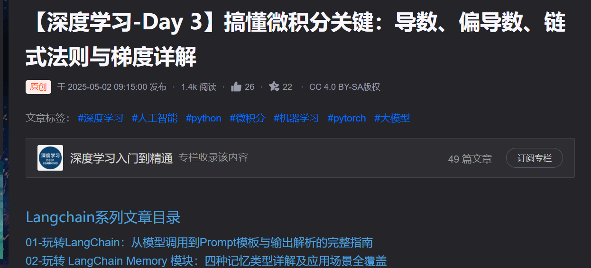
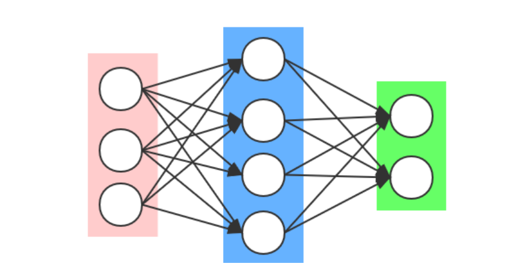
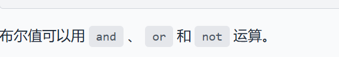
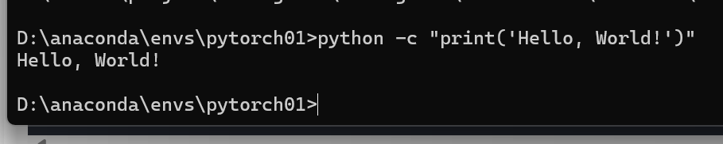
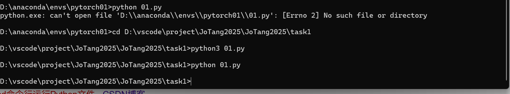

## 基本概念理解  
### 偏导数、链式法则、梯度、矩阵等数学概念在机器学习中的作用？  
1.导数/偏导数：指示函数的瞬时变化率，衡量了模型参数（如权重、偏置）的微小变动对损失函数的影响程度。  
2.梯度：由各个参数的偏导数组成的向量，指向函数值增长最快的方向。在梯度下降中，用负梯度指示函数下降最快的方向。  
3.矩阵/张量：多维向量组（二维为矩阵），用于表示多种维度的数据并进行计算。  
4.链式法则：复合函数求导法则，由外至内，依次求导。  

### 什么是“模型”？机器学习中的模型是如何工作的？  
模型本质上是一个函数。机器学习中通过训练数据来不断优化这个函数，使这个函数趋近于某事物的发展规律，可以通过已知数据来预测未来情况。
### 模型没有生物的意识和记忆，它们是如何“学习”的？  
通过大量样本数据使模型不断调整参数，使其能够识别不同的模式与特征，随后依据特定目标，输入大量特定范围数据，使模型更接近于真实规律。
### 什么是监督学习？什么是无监督学习？请分别举一个例子。  
1.监督学习：利用已经分类的数据，给出固定的分类参数进行训练。例：将邮件分为正常邮件与垃圾邮件。输入的数据已经被分为了正常与垃圾两类，且模型也只需将邮件分为这两类。
2.无监督学习：直接输入大量未分类的数据，由模型自身判断分类标准，并进行分类。例：平台将用户进行分类。平台不知道用户具体有哪些类型，模型通过用户的某些共同行为将他们分类。
### AI 是什么？深度学习和传统机器学习的区别？  
AI是一种模拟人类智慧思维的技术，用于复现人类的某些思维过程。  
区别：传统机器学习需要人来提取特征，所有模型较简单，需要数据较少，对硬件要求较低；深度学习可以自己学习特征，但需要大量训练数据。模型复杂，且对硬件要求较高。
### 怎么用矩阵乘法表示神经网络的全连接层前向传播过程？ 

用X表示输入  
$$X=\begin{bmatrix}
x_1\\
x_2\\
x_3\\
...
\end{bmatrix}$$  
随后在不同的层之间通过矩阵乘法的性质使其乘以不同的权重  
$$W=\begin{bmatrix}
w_{11}&w_{12}&...\\
w_{21}&w_{22}&...\\
...
\end{bmatrix}
$$
进行多次类似计算，得到不同隐藏层的输出，最后得到模型的输出  
## 编程与开发环境
### Python 与 C 语言的区别？  
1.效率：c快，python较慢。
2.数据：c语言需准确区分数据类型，而python无需区分。其次，c在计算int除法时只保留整数部分。 c在不调用bool.h的情况下没有严格意义上的布尔值，只依靠0和！0实现，而python具有bool值。
 
3.格式与符号：python的符号更便于阅读。c的缩进不影响代码执行，语句的分割依靠'{}',';'实现，而python语句要求严格的缩进。与或非的符号不同。
4.库：python有大量的库以实现不同功能。
5.指针：c有指针和动态内存分配，python只有引用。
### 如何用命令行运行 python 程序？  
1.运行单独语句：

2.运行已经写好的程序：需切换至文件所在目录

### 为什么需要 python 虚拟环境？在命令行中如何在不使用 conda 指令的情况下使用指定虚拟环境？  
python虚拟环境是独立的，可以将不同项目分割开，安装不同的插件与python版本，同时便于他人复制，不需要管理员权限。  
```c
python -m venv myenv//创建虚拟环境

myenv\Scripts\activate//激活虚拟环境

pip install <package_name>
python script.py//使用虚拟环境

deactivate//退出虚拟环境
```