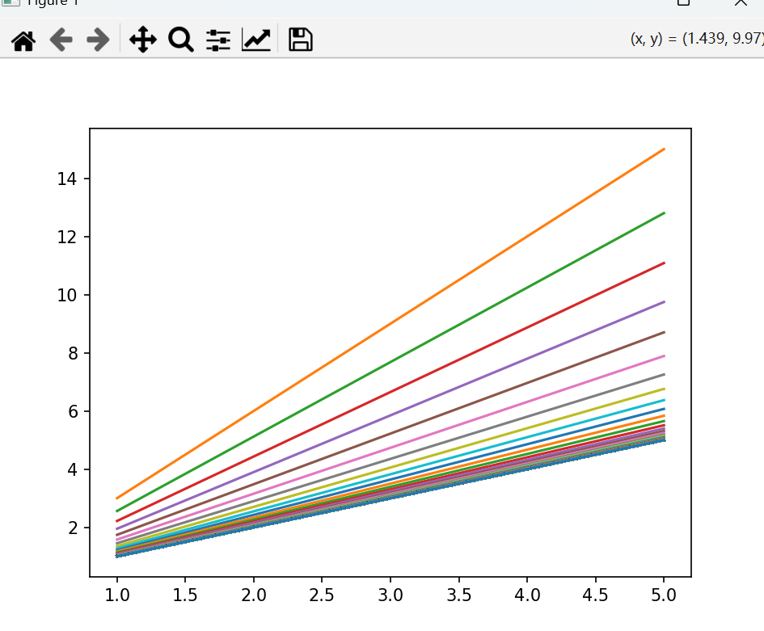
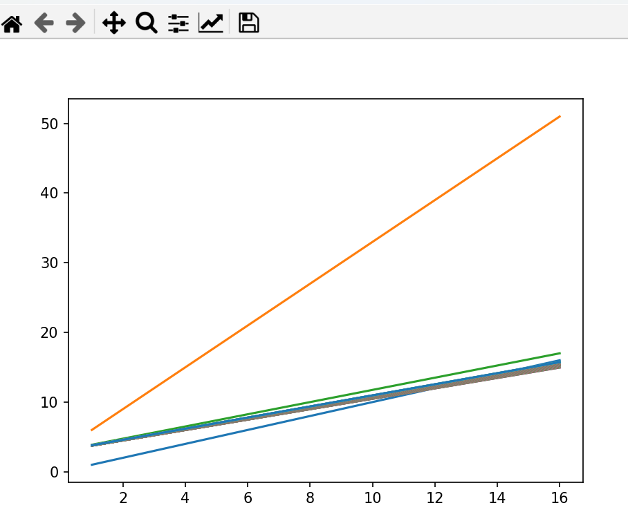

## 基础python运算
### 字典
```python
hyperparameters = {
    "learning_rate": 0.001,
    "batch_size": 32,
    "optimizer": "Adam",
    "epochs": 10
}
                           # 访问值 (通过键)
lr = hyperparameters["learning_rate"] # 0.001
print(f"Learning Rate: {lr}")
                           # 修改值
hyperparameters["epochs"] = 20
print(f"Updated hyperparameters: {hyperparameters}")

                           # 添加新键值对
hyperparameters["loss_function"] = "CrossEntropy"
print(f"Added loss: {hyperparameters}")
                           # 获取所有键或值
print(f"Keys: {hyperparameters.keys()}")
print(f"Values: {hyperparameters.values()}")
```
### class
```python
class Ex(object):
    a=0
    b=0
    def __init__(self,a,b):
        self.a=a
        self.b=b
    def p(self):
        print(self.a,self.b)
g=Ex(1,2)
g.p()
#结果为1 2
#继承与覆写
```
### numpy
```
np.sum(): 计算数组元素之和。
np.mean(): 计算数组元素的平均值。
np.std(): 计算数组元素的标准差。
np.var(): 计算数组元素的方差。
np.min(): 找出数组的最小值。
np.max(): 找出数组的最大值。
np.argmin(): 找出数组最小值的索引。
np.argmax(): 找出数组最大值的索引。
np.cumsum(): 计算元素的累积和。
np.cumprod(): 计算元素的累积积。
np.dot(a, b) 或 a @ b: 矩阵乘法（对于二维数组）或向量内积（对于一维数组）。
arr.T 或 np.transpose(arr): 矩阵转置。
np.linalg.inv(arr): 计算矩阵的逆。
np.linalg.det(arr): 计算矩阵的行列式。
np.linalg.eig(arr): 计算矩阵的特征值和特征向量。
np.linalg.svd(arr): 计算奇异值分解 (SVD)。
```
### 求导/偏导  
利用sympy库进行导数/偏导数运算
```python
import sympy
x = sympy.symbols('x')     # 定义符号变量 x
f = x**2                   # 定义函数 f(x) = x^2
f1=sympy.diff(f, x)        # 计算导数
print("f'(x)=",f1)
re=f1.subs(x, 2)           # 计算在 x=2 处的导数值
print("f'(2)=",re)
```
### 梯度
在降一维的体（面、线）上（降f(x)的那根轴）的方向向量，模为导数的值。由于损失函数都有$\sum$，则对单个部分求导。
```python
import sympy
x,y=sympy.symbols('x y')
f=x*y+x+y
fx=sympy.diff(f,x)         # 对于x的偏导数
fy=sympy.diff(f,y)         # 对于y的偏导数
a=(fx.subs({x:1,y:1}),fy.subs({x:1,y:1}))
print(a)
```
### 数据库
sklearn.datasets.make_moons(n_samples=100, shuffle=True, noise=None, random_state=None)  
### 线性拟合
先只进行含有权重w的拟合  
```python
import numpy as np
import matplotlib.pyplot as plt
import sympy as sym
xs=np.array([1,2,3,4,5])
ys=np.array([1,2,3,4,5])
w=3
l=0.01


def forward(x,w):         # 进步
    return x*w
def loss(xs,ys,w):        # 损失函数
    cost=0                  
    assert len(xs)==len(ys) 
    for x,y in zip(xs,ys):
        cost=(x*w-y)**2+cost
        return np.mean(cost)
def ge(xs,ys,w):          # 梯度下降
    f1=0
    re=0
    w0=sym.symbols('w0')
    for x,y in zip(xs,ys):
        f=(w0*x-y)**2
        f1=sym.diff(f,w0)
        re=re+f1.subs(w0,w)
    return re/len(xs)


plt.plot(xs,ys)
for i in range(500):
    py=w*xs
    co=loss(xs,ys,w)
    w=w-l*ge(xs,ys,w)
    plt.plot(xs,py)
plt.show()
```
运行结果：  

下面加入偏置b  
```python
import numpy as np
import matplotlib.pyplot as plt
import sympy as sym
xs=np.array([1,2,3,4,5,6,7,8,9,10,11,12,13,14,15,16])
ys=np.array([1,2,3,4,5,6,7,8,9,10,11,12,13,14,15,16])
w=3
b=3
bn=np.ones(len(xs),)
bn=b*bn
l=0.005


def forward(x,w):         
    return x*w
def ge(xs,ys,w,b):         
    f1=0
    re1=0
    re2=0
    w0,b0=sym.symbols('w0,b0')
    for x,y in zip(xs,ys):
        f=(w0*x+b0-y)**2
        f1=sym.diff(f,w0)
        re1=re1+f1.subs({w0:w,b0:b})
        f2=sym.diff(f,b0)
        re2=re2+f2.subs({w0:w,b0:b})
    return re1/len(xs),re2/len(xs)


plt.plot(xs,ys)
for i in range(100):
    py=w*xs+bn
    t1,t2=ge(xs,ys,w,b)
    w=w-l*t1
    b=b-l*t2
    plt.plot(xs,py)
plt.show()
```
运行结果：  
