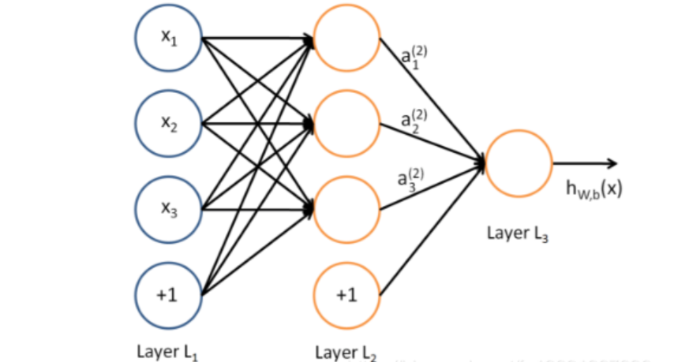

### 多层感知机MLP、神经元、非线性表达能力与激活函数  
MLP是一种人工神经网络模型，是由多个神经元组成的多层结构。它是一种前馈式神经网络，通常用于解决分类和回归问题。基本结构包括输入层、输出层和至少一层或多层的隐藏层，层与层之间是全连接。  

神经元：通过算法模拟真实神经元，人工神经元接收来自其他神经元或外部源的输入，每个输入都有一个相关的权值，对该输入加权并与其他输入求和后，经过一个激活函数，计算得到该神经元的输出。  
激活函数：使神经元的输出由线性变为非线性，使得神经网络可以逼近其他的任何非线性函数。
常见激活函数：sigmoid函数(在物理意义上最为接近生物神经元)、tanh函数(减少迭代次数)、ReLU(用于隐层神经元输出)、Softmax函数(用于多分类神经网络输出)、ELU(融合了sigmoid和ReLU)、Maxout(能够近似任意连续函数).  
非线性表达能力：指模型通过非线性方法来拟合复杂数据分布和特征，从而提高其学习和预测能力，即通过激活函数引入非线性，使得模型能够跟贴合事物的本质。  
### 前向传播、梯度、学习率、反向传播、常见的优化器
前向传播：将上一层的输出作为下一层的输入，并计算下一层的输出，一直到运算到输出层为止。  
反向传播：将计算结果与真实值对比，即计算损失函数对各参数的梯度，并根据梯度进行参数的更新。  
梯度：由各个参数的偏导数组成的向量，指向函数值增长最快的方向。在梯度下降中，用负梯度指示函数下降最快的方向。
$$
\nabla f=\left(\frac{\partial f}{\partial x_1},\frac{\partial f}{\partial x_2},...,\frac{\partial f}{\partial x_n}\right)
$$ 
学习率：参数每次变化的量$\eta$，控制模型学习的速度。  
$$
\theta_n=\theta_{n-1}-\eta\nabla f
$$
优化器：寻找最优解且避免局部最优解。常见的有随机梯度下降法SGD、带动量的SGD、Nesterov加速梯度、自适应梯度算法、RMSProp、Adam
### 隐藏层  
隐藏层是人工神经网络中的中间层，位于输入层和输出层之间，通过线性变换和激活函数来捕捉数据中的复杂模式和特征。它的作用是对输入数据进行特征提取和变换，为最终的输出层提供高层次特征。隐藏层这个术语之所以称为“隐藏”，是因为其输出对外界不可见，只在网络内部流通。  
多层隐藏层：通过多层隐藏层的堆叠，网络可以逐渐提取出数据中越来越抽象的特征
### 损失函数  
预测值$f(x)$与真实$Y$的差异程度
$$
L(Y|f(x))
$$
距离损失函数：  
均方差、L1、SMOOTH L1、L2、huber(用于回归问题)  
概率损失函数：  
 KL散度、交叉熵损失(用于多分类、二分类问题)、softmax、Focal loss(解决的是类别不平衡和难易样本不均衡的问题)
### 计算图  
定义：用节点表示变量，用边表示数学操作来表示一个给点的数学表达式，是一种用来描述计算过程的有向无环图。  
区别：数据结构/离散数学中学的图更注重研究对象之间的关系，使一种静态的图，不可被执行，而计算图侧重描述计算过程，可以被执行。  
构建：  
显式构建：在模型运行前，先手动构建整个计算图结构，然后再运行数据。  
隐式构建：代码运行时自动按执行顺序构建计算图。
### MLP参数  
参数量计算：所有层的权重参数和偏置参数的总和
$$
P=\sum^L_{l=1} W_l+\sum^L_{l=1} B_l
$$
参数：可以被学习和调整的参数，通常是通过训练数据来自动学习的，以最小化损失函数或优化目标。  
超参数：在算法运行之前手动设置的参数，用于控制模型的行为和性能。MLP中超参数主要为：学习率、隐藏层层数、每层神经元个数、激活函数、Batch size等。
### 数据在神经网络中的角色
#### 标签、特征与噪声
标签：模型预测的事物，即f(x)的因变量。  
特征：输入的变量，即f(x)的自变量。  
噪声：数据集中的随机误差或错误、不准确的数据。
#### Batch size、为什么堆叠成 Batch 可以提高运算速度？
Batch Size 是指在机器学习和深度学习模型训练过程中，每次迭代所使用的样本数量。它决定了模型在更新权重时所使用的数据量大小。当 batch size 增大时，更多的数据可以并行处理，这可能会提高GPU的利用率，从而在一定程度上减少每个样本的平均计算时间。
### 归一化与正则化
归一化：一种简化计算的方式，将数据映射到较小的区间中，同时统一量纲，以减小噪声带来的影响。  
正则化：防止模型过拟合的手段，限制cost较高次参数的大小。通过引入适当大小的正则化参数进行正则化（过大欠拟合，过小无效）。正则项通常为二次，便于求导计算。
### 欠拟合与过拟合
欠拟合：拟合程度较低，训练样本集准确率低。&ensp;原因：训练样本少；模型复杂度低；结束训练过早   
过拟合：拟合程度过高导致包含大量噪声，函数不平滑，使测试集准确率低。&ensp;原因：数据噪声太大；模型太复杂